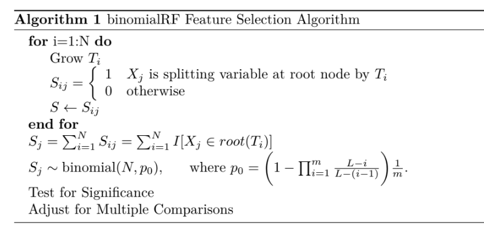

```{r setup, include = FALSE}
  library('randomForest')
  library('data.table')
  library('stats')
  library('binomialRF')
  library('ggplot2')
  
knitr::opts_chunk$set(
  collapse = TRUE,
  comment = "#>"
)
```


The $\textit{binomialRF}$ is a $\textit{randomForest}$ feature selection wrapper (Zaim 2019) that treats the random forest as a binomial process where each tree represents an iid bernoulli random variable for the event of selecting $X_j$ as the main splitting variable at a given tree. The algorithm below describes the technical aspects of the algorithm.

\begin{algorithm} 
\caption{binomialRF Feature Selection Algorithm } 
\label{alg1} 
\begin{algorithmic}
  \For{i=1:N}
    \State Grow $T_{i}$
    \State $S_{ij} =   \left\{
\begin{array}{ll}
      1 & X_j \text{ is splitting variable at root node by } T_i \\
      0 & \text{otherwise} \\
 \end{array} 
\right. $
    \State $S \gets S_{ij}$
  \EndFor
  \State $S_j = \sum_{i=1}^N S_{ij}= \sum_{i=1}^N I[X_j \in root(T_i)]$
  \State $S_j \sim \text{binomial}(N,p_0), \hspace{6mm} \text{where } p_0=\bigg(1 - \prod_{i=1}^m\frac{L-i}{L-(i-1)} \bigg)\frac{1}{m}$.
  \State Test for Significance
  \State Adjust for Multiple Comparisons

\end{algorithmic}
\end{algorithm}



# Simulating Data
Since $\textit{binomialRF}$ is a wrapper algorithm that internally calls and grows a randomForest object based on the inputted parameters. First we generate a simple simulated logistic data as follows: 

* $X_{10}\sim MNV(0, I_{10})$, 


* $p(x) = \frac{1}{1+e^{-X\beta}}$, and

* $y \sim Binom(10,p)$.


## Simulated Data

```{r echo=T, warning=F, message=F}
set.seed(324)

### Generate multivariate normal data in R10
X = matrix(rnorm(1000), ncol=10)

### let half of the coefficients be 0, the other be 10
trueBeta= c(rep(10,5), rep(0,5))

### do logistic transform and generate the labels
z = 1 + X %*% trueBeta    
pr = 1/(1+exp(-z))        
y = rbinom(100,1,pr)

```
To generate data looking like this: 
```{r, echo=FALSE, results='asis'}
knitr::kable(head(cbind(round(X,2),y), 10))
```

# binomialRF Function Call

```{r echo=T, warning=F, message=F}
binom.rf <- binomialRF::binomialRF(X,factor(y), fdr.threshold = .05,
                     ntrees = 2000,percent_features = 1,
                     fdr.method = 'BY',correlationAdjustment =FALSE,
                     user_cbinom_dist = NULL, sampsize = round(nrow(X)*.33)
                     )
print(binom.rf)

```

# Tuning Parameters

## Percent_features

Note that since the binomial exact test is contingent on a test statistic measuring the likelihood of selecting a feature, if there is a dominant feature, then it will render all remaining 'important' features useless as it will always be selected as the splitting variable. Therefore it is important to select the $\textit{percent_features}$ parameter to be small (~ sqrt(p) or between 10-25%) so that at each tree we can successfully identify all important features. 

If you're working in a low-dimensional space, with $\textit{L}$ features, then percent_features must be at least greater than $1/\textit{L}$. However, for optimal performance, percent_features will be increased to at least 3/L since otherwise when only 1 variable is selected at the splitting procedure, there is no binomial process since the single variable chosen is then the 'optimal' splitting variable. Therefore, consider setting percent_features to be equivalent to the mtry parameter in the randomForest to ensure that at least 2+ features are considered at each root node, but not large enough so that the same dominant feature gets chosen. 


```{r echo=F, warning=F, message=F}
# set.seed(324)

binom.rf <- binomialRF::binomialRF(X,factor(y), fdr.threshold = .05,
                     ntrees = 2000,percent_features = 1,
                     fdr.method = 'BY',correlationAdjustment =FALSE,
                     user_cbinom_dist = NULL, sampsize = round(nrow(X)*.33)
                     )

cat('\n\nbinomialRF 100%\n\n')
print(binom.rf)
```

## ntrees

We recommend growing at least 500 to 1,000 trees at a minimum so that the algorithm has a chance to stabilize, but also recommend choosing ntrees as a function of the number of features in your dataset. The ntrees tuning parameter must be set in conjunction with the percent_features as these two are inter-connectedm as well as the number of true features in the model. 


```{r echo=F, warning=F, message=F}
set.seed(324)

binom.rf <- binomialRF::binomialRF(X,factor(y), fdr.threshold = .05,
                     ntrees = 500,percent_features = 1,
                     fdr.method = 'BY',correlationAdjustment =FALSE,
                     user_cbinom_dist = NULL, sampsize = round(nrow(X)*.33)
                     )

binom.rf2 <- binomialRF::binomialRF(X,factor(y), fdr.threshold = .05,
                     ntrees = 1000,percent_features = 1,
                     fdr.method = 'BY',correlationAdjustment =FALSE,
                     user_cbinom_dist = NULL, sampsize = round(nrow(X)*.33)
                     )


cat('\n\nbinomialRF 500 trees\n\n')
print(binom.rf)

cat('\n\nbinomialRF 1000 trees \n\n')
print(binom.rf2)

```


## Correlation Adjustment

The binomialRF runs a binomial exact test to determine significance. However, the binomial distribution assumes independent trials. Therefore, we offer both the naive binomial as well as a correlation adjustment based on the $\textit{correlbinom}$ R package for exchangeable but correlated binary trials. 